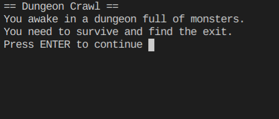
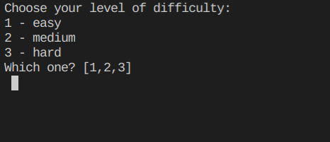
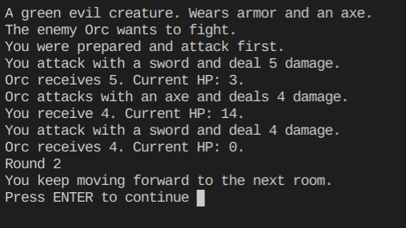
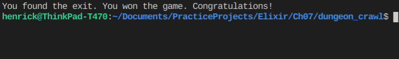

# DungeonCrawl

DungeonCrawl game exercise from the book "Learn Functional Programming with Elixir"

## Screenshots

## Todo
- [x] In the current game all the rooms have the same chance of appearing.
That means the exit room might show up immediately, leading to a very
short and dull game. Make it so certain rooms have a greater probability
of showing up than others do.

- [x] Add an extra option at the beginning of the game to allow players to choose
the difficulty level. For example, when the player wants the game to be
hard, the exit and healing rooms will be difficult to find.

- [x] Implement a feature that changes the probability of the exit room
appearing based on how many places the hero has visited. For example,
at the beginning of the game the exit room will have no probability of appearing, 
but after some certain number of rounds, the chances of it appearing increase.

- [] Implement a scoring system. When the hero survives traps, defeats ene-
mies, or finds treasures, the player’s score will increase. When the player
beats the game, the score is saved in a file. The file must contain only the
top 10 scores.

- [] Make it so the hero can store items in his pocket to use later. For example,
he can pick up the healing potion in the treasure room and use it later,
when he’s lost hit points. Add an option to use the item when listing room
actions. It’s good to indicate the maximum number of items the hero can
accumulate.

- [] Improve the battle module by giving the player the option to run away or
attack in that round. When the hero is fleeing, he’ll receive one attack
from the enemy before making his escape.

## Run The Game
`mix compile`
`mix start`

